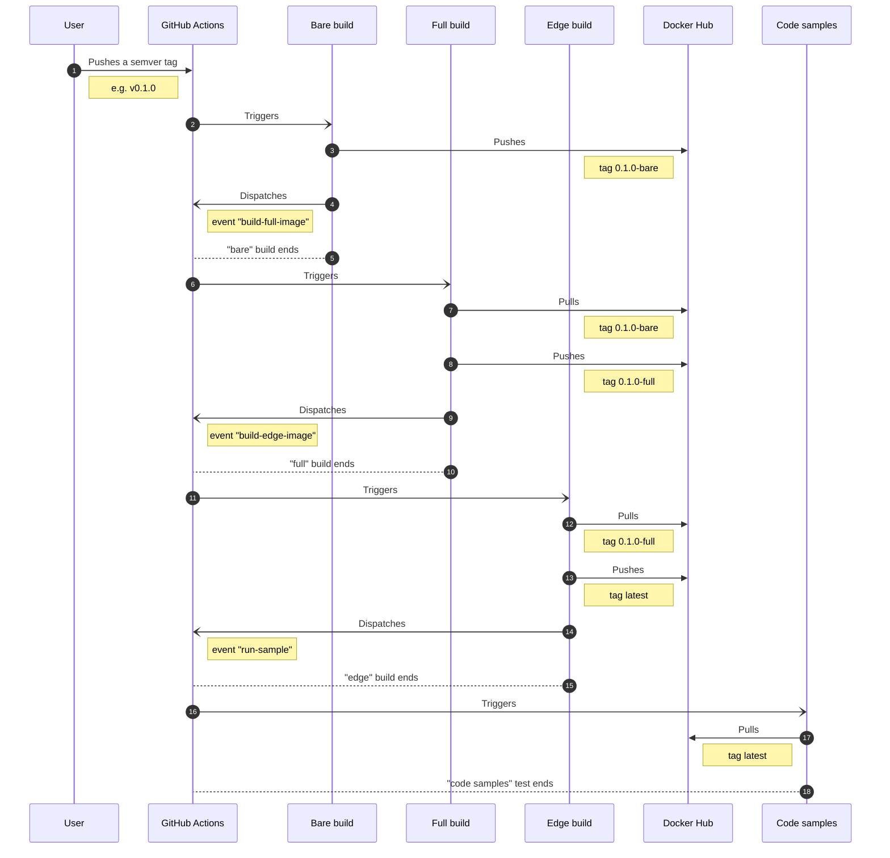

# Docker monorepo with self-dependencies

This project exemplifies how to create a Docker [monorepo][monorepo] that has self-dependencies
(one docker image based on another, inside this same repository) using [GitHub Actions][github-actions].

[github-actions]: https://github.com/features/actions
[monorepo]: https://monorepo.tools

## Tag push diagram

