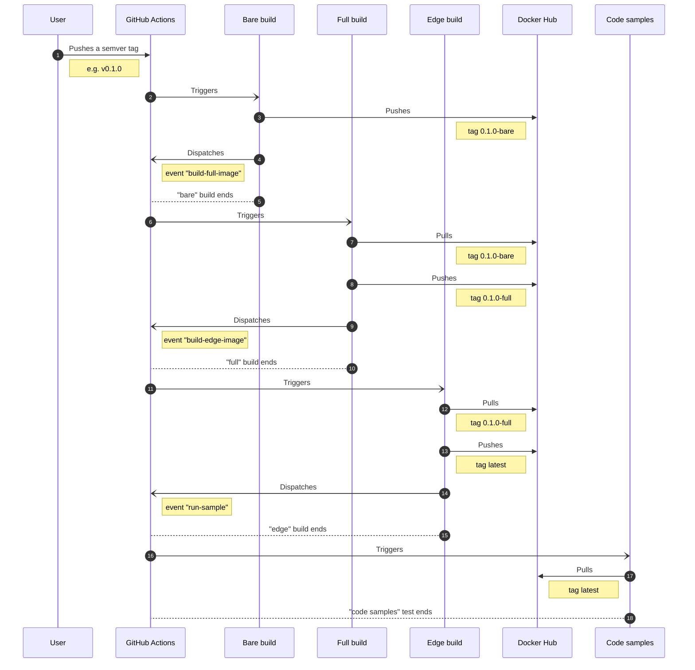

[![bare image][gh-bare-shield]][gh-bare-url]
[![full image][gh-full-shield]][gh-full-url]
[![edge image][gh-edge-shield]][gh-edge-url]
[![github tag][tag-shield]][tag-url]

# Docker monorepo with self-dependencies

This project exemplifies how to create a Docker [monorepo][monorepo] that has self-dependencies
(one docker image based on another, inside this same repository) using [GitHub Actions][github-actions].

[tag-shield]: https://img.shields.io/github/tag/caian-org/docker-monorepo-self-dependent.svg?logo=git&logoColor=FFF&style=for-the-badge
[tag-url]: https://github.com/caian-org/docker-monorepo-self-dependent/tags

[gh-bare-shield]: https://img.shields.io/github/workflow/status/caian-org/docker-monorepo-self-dependent/build-bare-image?label=bare&logo=docker&logoColor=FFF&style=for-the-badge
[gh-bare-url]: https://github.com/caian-org/docker-monorepo-self-dependent/actions/workflows/build-bare-image.yml

[gh-full-shield]: https://img.shields.io/github/workflow/status/caian-org/docker-monorepo-self-dependent/build-full-image?label=full&logo=docker&logoColor=FFF&style=for-the-badge
[gh-full-url]: https://github.com/caian-org/docker-monorepo-self-dependent/actions/workflows/build-full-image.yml

[gh-edge-shield]: https://img.shields.io/github/workflow/status/caian-org/docker-monorepo-self-dependent/build-edge-image?label=edge&logo=docker&logoColor=FFF&style=for-the-badge
[gh-edge-url]: https://github.com/caian-org/docker-monorepo-self-dependent/actions/workflows/build-edge-image.yml

[github-actions]: https://github.com/features/actions
[monorepo]: https://monorepo.tools

Lorem ipsum dolor sit amet, consectetur adipiscing elit. Aliquam sollicitudin ipsum quis porttitor euismod. Curabitur
auctor odio massa, in ultrices ex condimentum non. Donec in hendrerit diam. Suspendisse vestibulum justo felis, nec
ultrices erat fermentum non. Quisque magna massa, ullamcorper at eros id, rutrum placerat velit. Mauris vulputate, nunc
a aliquet scelerisque, lectus massa sollicitudin nisi, auctor laoreet lorem tellus ut massa. Ut malesuada, nisi non
pellentesque porta, purus est sagittis odio, condimentum laoreet metus nisi quis diam.

## Tag push diagram

<strong>Tag push sequence diagram</strong> (click to expand :arrow_down:)

## License

To the extent possible under law, [Caian Ertl][me] has waived __all copyright
and related or neighboring rights to this work__. In the spirit of _freedom of
information_, I encourage you to fork, modify, change, share, or do whatever
you like with this project! [`^C ^V`][kopimi]

[![License][cc-shield]][cc-url]

[me]: https://github.com/upsetbit
[cc-shield]: https://forthebadge.com/images/badges/cc-0.svg
[cc-url]: http://creativecommons.org/publicdomain/zero/1.0

[kopimi]: https://kopimi.com
