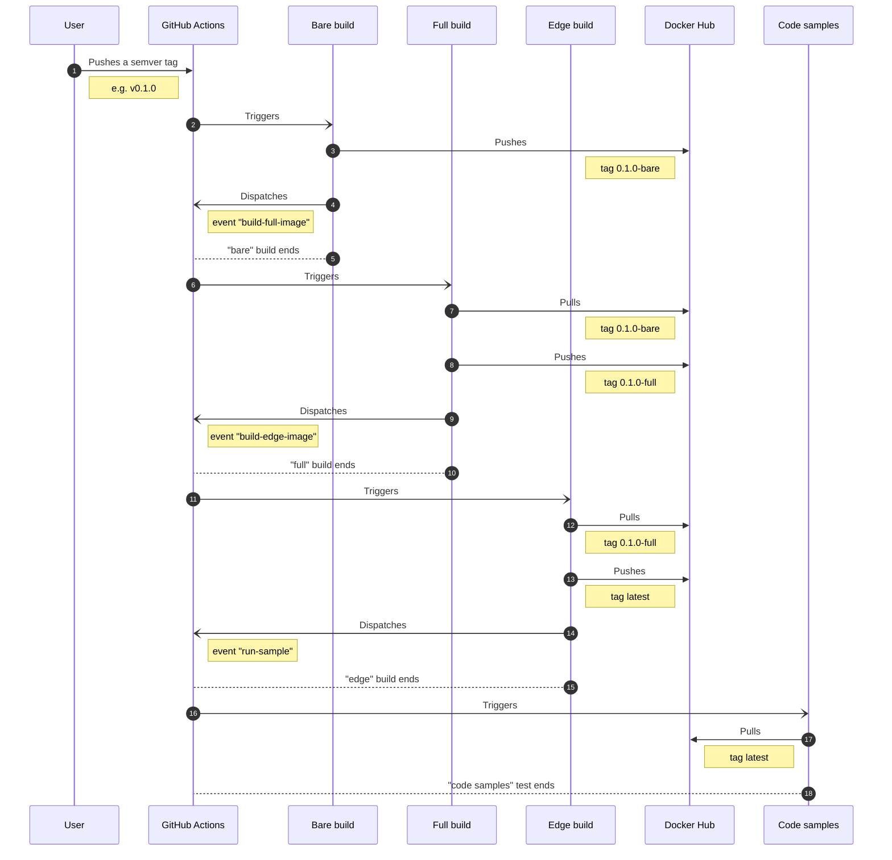
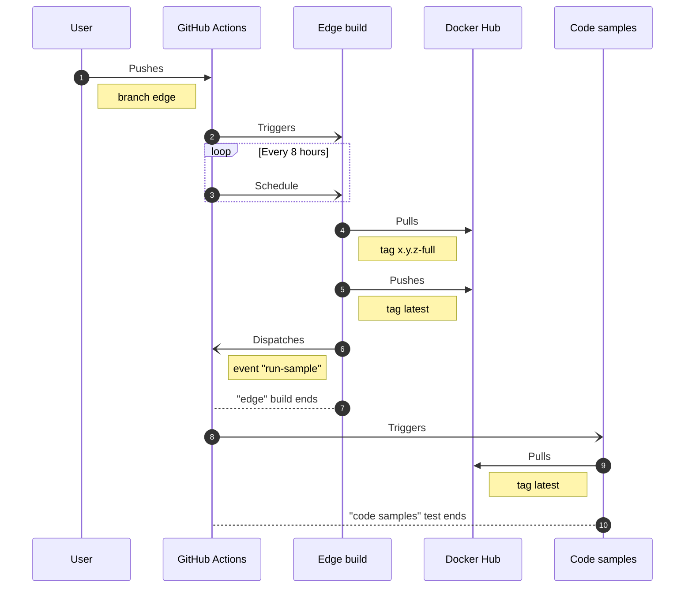

  
  
  
  

<h1 align="center">docker monorepo with self-dependencies</h1>

  

This project exemplifies how to create a Docker [monorepo][monorepo] that has self-dependencies
(one docker image based on another, inside this same repository) using [GitHub Actions][github-actions].

[github-actions]: https://github.com/features/actions
[monorepo]: https://monorepo.tools

<ul>
<li>

<strong>Sequence diagram: Tag push</strong> <em>(click to expand)</em>

</li>

<li>

<strong>Sequence diagram: Edge branch push</strong> <em>(click to expand)</em>

</li>
</ul>

## License

To the extent possible under law, [Caian Ertl][me] has waived __all copyright
and related or neighboring rights to this work__. In the spirit of _freedom of
information_, I encourage you to fork, modify, change, share, or do whatever
you like with this project! [`^C ^V`][kopimi]

[![License][cc-shield]][cc-url]

[me]: https://github.com/upsetbit
[cc-shield]: https://forthebadge.com/images/badges/cc-0.svg
[cc-url]: http://creativecommons.org/publicdomain/zero/1.0

[kopimi]: https://kopimi.com
